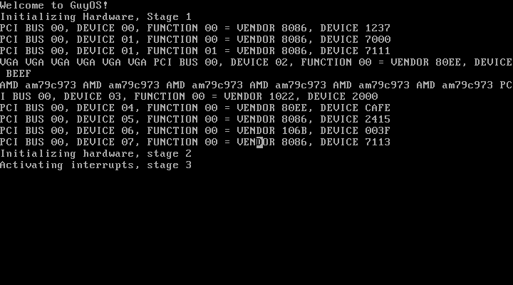

# GuyOS
GuyOS is an operating system written in order to learn more about the inner workings of operating systems,
kernel development and more.

## Screenshots



## Features
* 32 bit Protected mode
* Dynamic drivers system
* Keyboard and mouse drivers
* Basic GUI framework
* Networking
* Multitasking
* Memory Management


## Building
Install required packages:
```bash
sudo apt-get install g++ binutils libc6-dev-i386 VirtualBox grub-pc-bin xorriso
```
Create a virtual machine without a hard drive.

To create a bootable ISO image, simply run:
```bash
make clean
make
```
Link the Virtual machine you created to the ISO image


## Current Goals
Here are the goals for the future.

* Support Networking
* A better GUI Framework
* Build an extended libc
